# 🌳 Forest Cover Change Detection

## 👥 Répartition du travail

- Eya a travaillé sur la **Partie A** : analyse initiale, prétraitement, histogrammes, ratio vert et features locales.
- Yasmine a travaillé sur la **Partie B** : segmentation, clustering, identification automatique de la végétation, quantification et analyse finale.

---

## 🎯 Objectif du projet

Ce projet vise à **détecter et analyser les changements de couverture du sol entre deux images satellites prises à des dates différentes (`t0` et `t1`)**, afin d’identifier une éventuelle **déforestation**.

L’objectif final est de :

* détecter les zones de changement
* localiser ces changements
* préparer la quantification de la perte de végétation

---

## 📂 Structure du projet

```text
forest-cover-change-detection/
│
├── data/
│   ├── t0.png
│   └── t1.png
│
├── notebooks/
│   └── .gitkeep
│
├── outputs/
│   ├── preprocessed_images/
│   │   ├── 16_t0_preprocessed.png
│   │   └── 17_t1_preprocessed.png
│   ├── 01_images_initiales.png
│   ├── 02_histogramme_t0.png
│   ├── 03_histogramme_t1.png
│   ├── 04_images_pretraitees.png
│   ├── 05_ratio_vert_t0.png
│   ├── 06_ratio_vert_t1.png
│   ├── 07_moyenne_locale_t0.png
│   ├── 08_moyenne_locale_t1.png
│   ├── 09_variance_locale_t0.png
│   ├── 10_variance_locale_t1.png
│   ├── 11_change_map.png
│   ├── 12_change_mask_brut.png
│   ├── 13_change_mask_nettoye.png
│   ├── analysis_summary.png
│   ├── deforestation_map.png
│   ├── dendrogram_t0.png
│   ├── dendrogram_t1.png
│   ├── metrics.json
│   ├── segmentation_t0.png
│   ├── segmentation_t1.png
│   ├── vegetation_mask_t0.png
│   └── vegetation_mask_t1.png
│
├── src/
│   ├── analysis.py
│   ├── clustering.py
│   ├── features.py
│   ├── io_utils.py
│   ├── main.py
│   ├── preprocessing.py
│   ├── visualization.py
│   └── __init__.py
│
├── requirements.txt
└── README.md
```

---

## ⚙️ Installation

Créer un environnement virtuel :

```bash
python -m venv venv
```

Activer l’environnement :

### Windows

```bash
venv\Scripts\activate
```

### Mac / Linux

```bash
source venv/bin/activate
```

Installer les dépendances :

```bash
pip install -r requirements.txt
```

---

## ▶️ Exécution

Depuis la racine du projet :

```bash
python src/main.py
```

Les résultats seront générés dans le dossier `outputs/`.

---

## 🧠 Méthodologie

### 1. Analyse initiale

* Chargement des images `t0` et `t1`
* Visualisation
* Analyse des histogrammes RGB

👉 Permet de comprendre les différences globales entre les deux dates.

## 🖼️ Images initiales

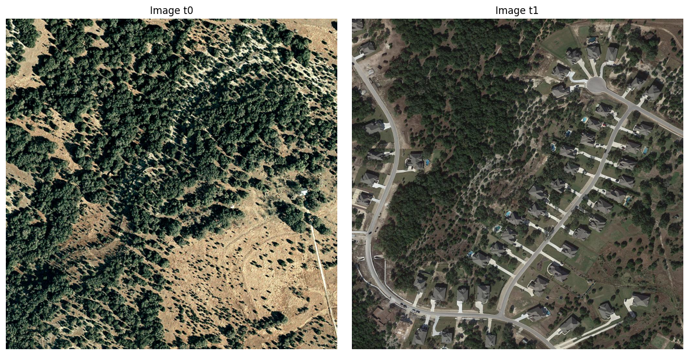

---

### 2. Prétraitement

* Débruitage médian
* Amélioration du contraste local (CLAHE)

👉 Objectif : améliorer la qualité visuelle et rendre les structures plus discriminantes.

## ⚙️ Prétraitement

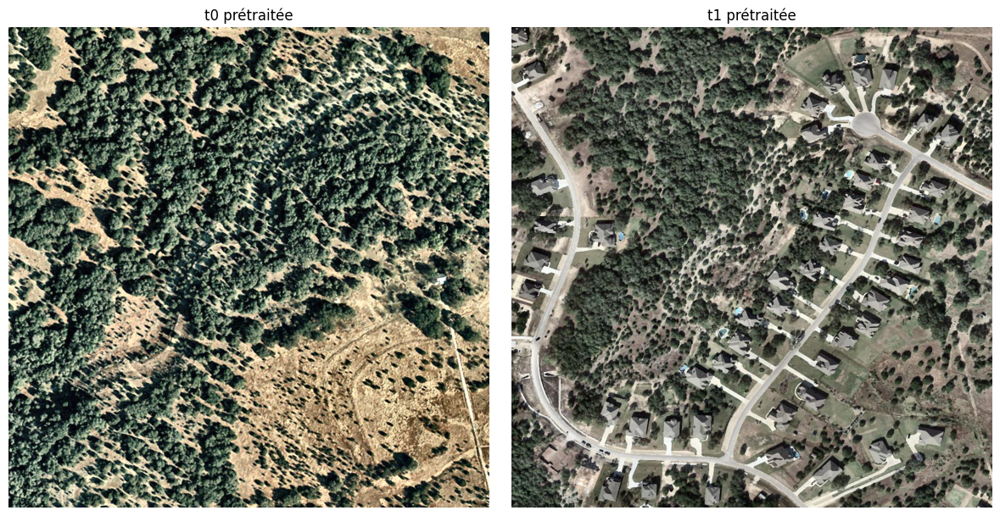

---

### 3. Représentation des pixels

* RGB
* HSV
* Ratio vert

👉 Le **ratio vert** permet de mettre en évidence la végétation.

---

### 4. Features locales

* Moyenne locale
* Variance locale

👉 Ces descripteurs capturent :

* la structure
* la texture
* les contours (notamment utiles pour détecter l’urbanisation)

---

### 5. Détection de changement

* Calcul de la différence entre `t0` et `t1`
* Combinaison de plusieurs features :

  * ratio vert
  * moyenne locale
  * variance locale

👉 Permet de construire une **carte de changement**

## 🌿 Ratio vert

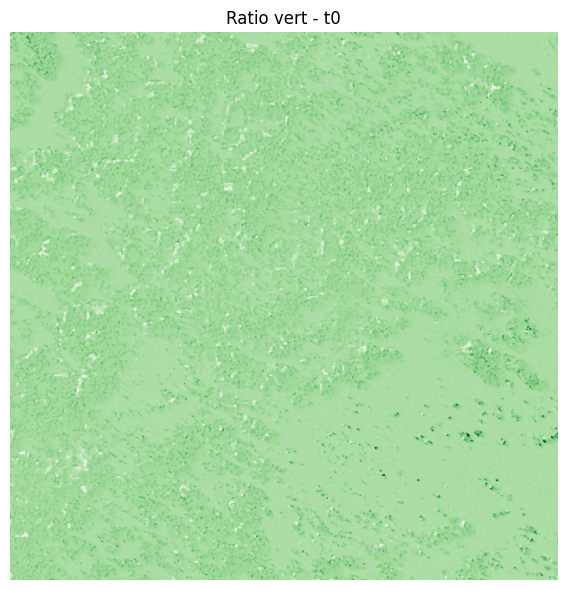

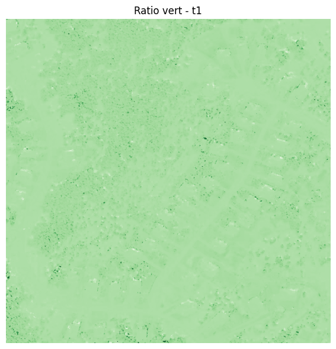

## 🔥 Carte de changement

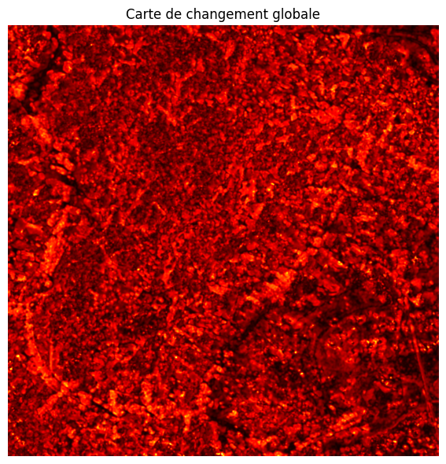

---

### 6. Génération du masque

* Seuillage automatique
* Nettoyage morphologique
* Suppression des petites zones

👉 Permet d’isoler les zones de changement significatif

## 🎯 Détection finale

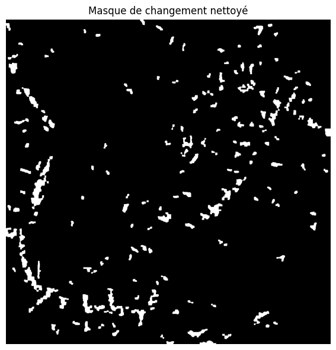

---

## 📊 Résultats

Le dossier `outputs/` contient :

* images initiales
* histogrammes RGB
* images prétraitées
* ratio vert
* moyenne locale
* variance locale
* carte de changement
* masque de changement final

---

## 📌 Interprétation

Les résultats montrent une **réduction des zones végétalisées entre `t0` et `t1`**, accompagnée de l’apparition de structures (routes, bâtiments).

👉 Cela indique une **urbanisation et une perte de végétation**, cohérente avec un phénomène de déforestation.

---

## ⚠️ Limites

* Absence d’alignement parfait entre les images
* Sensibilité aux conditions d’éclairage
* Détection basée sur des heuristiques simples

👉 Des améliorations possibles :

* recalage des images
* normalisation radiométrique
* segmentation avancée (KMeans)

---

## 🚀 Suite du projet

La suite consiste à :

* appliquer une **classification (KMeans)**
* identifier automatiquement la végétation
* calculer la surface végétalisée
* quantifier la perte de végétation

---

## 🧠 Conclusion

Ce projet met en place un pipeline complet de traitement d’images pour :

* extraire des caractéristiques pertinentes
* comparer deux dates
* détecter les changements de couverture du sol

👉 La végétation est utilisée comme indicateur principal pour analyser la déforestation.

---

## 🧪 Partie B - Yasmine

Cette partie correspond à l’étape de segmentation et d’analyse quantitative à partir des images prétraitées.

### Images utilisées

- image avant : `outputs/preprocessed_images/16_t0_preprocessed.png`
- image après : `outputs/preprocessed_images/17_t1_preprocessed.png`

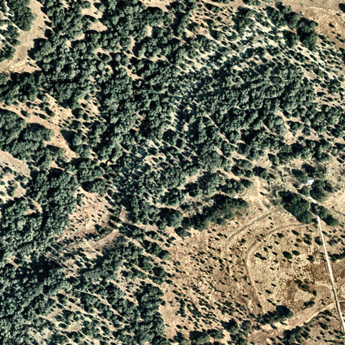

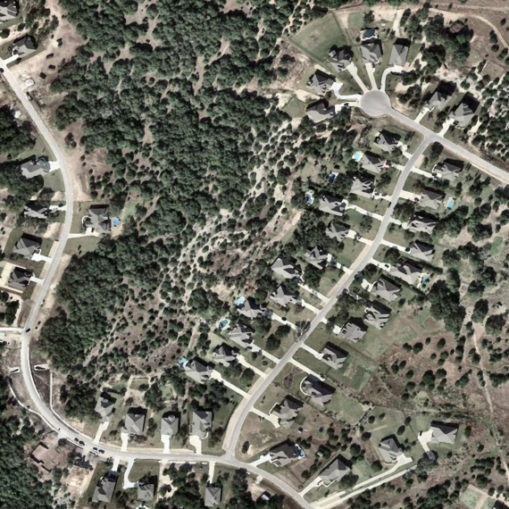

### Méthode utilisée

- extraction des features `RGB + HSV + ratio vert + moyenne locale + variance locale`
- segmentation par `K-means`
- choix automatique du cluster végétation via le score de ratio vert
- nettoyage morphologique des masques
- comparaison entre `t0` et `t1`
- génération des métriques et des visualisations finales

### Résultats de la partie B

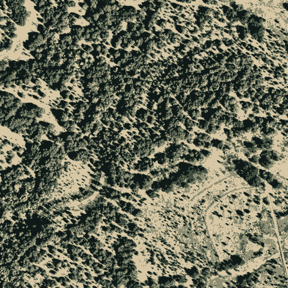

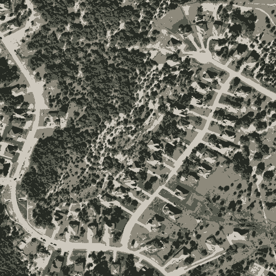

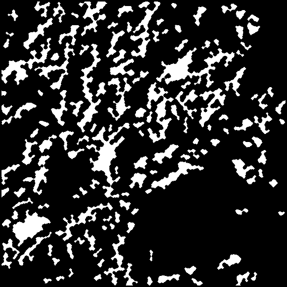

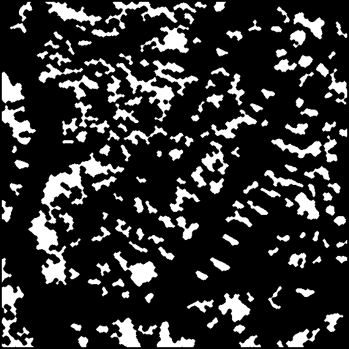

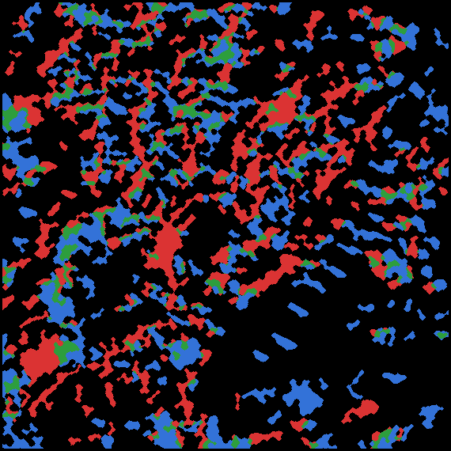

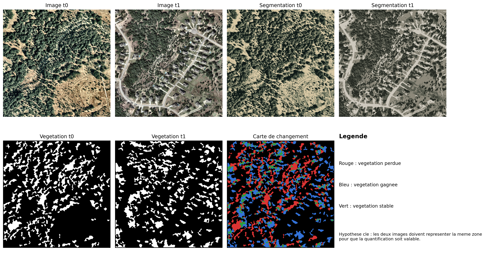

### Métriques obtenues

Les métriques sont enregistrées dans `outputs/metrics.json`.

- végétation avant (`t0`) : `18.38%`
- végétation après (`t1`) : `18.85%`
- variation nette : `+0.47` point de pourcentage
- `net_loss_ratio_formula = -2.58%`

Lecture :

- si `net_loss_ratio_formula` est positif, cela indique une perte nette de végétation
- s’il est négatif, cela indique un gain net de végétation
- dans ce run, le pipeline détecte donc un léger gain net, et non une perte nette

### Interprétation de la partie B

Le pipeline produit bien une segmentation, des masques de végétation et une carte de changement. Les sorties sont cohérentes techniquement, mais l’interprétation doit rester prudente car la carte de changement reste très morcelée.

Cela peut venir de plusieurs facteurs :

- léger désalignement entre les deux images
- différences visuelles liées au prétraitement
- sensibilité de la segmentation au rendu radiométrique
